<div align="center">
<table>
  <tr>
    <td align="center"></td>
    <td align="center"></td>
  </tr>

  
# Wayfarer
### Complete the map of your life

A native Quickshell / Omarchy bar plugin. A tiny progress whisper in the bar
(`36/77`), a large floating map on click, and the slow satisfaction of watching
muted graphite turn into colour.

[Features](#features) · [Screenshots](#screenshots) · [Layout](#layout) · [Try it](#try-it) · [Visual language](#visual-language)

</div>


### The map

<table>
  <tr>
    <td width="50%" align="center"><strong>Nepal, all 77 districts</strong><br>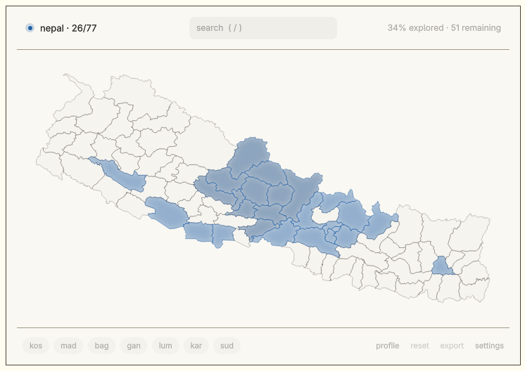</td>
    <td width="50%" align="center"><strong>India</strong><br>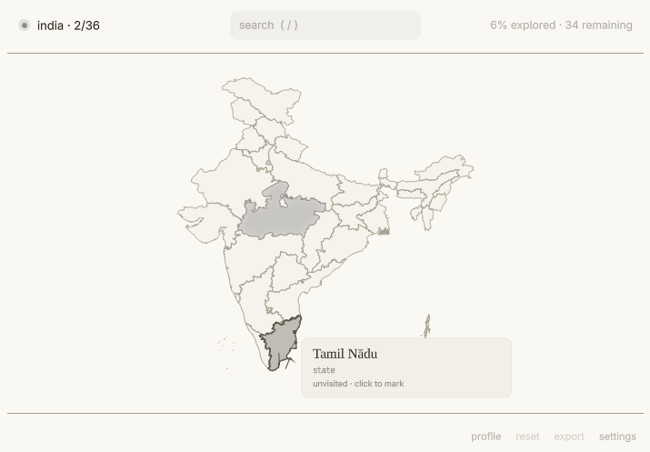</td>
  </tr>
  <tr>
    <td width="50%" align="center"><strong>China</strong><br>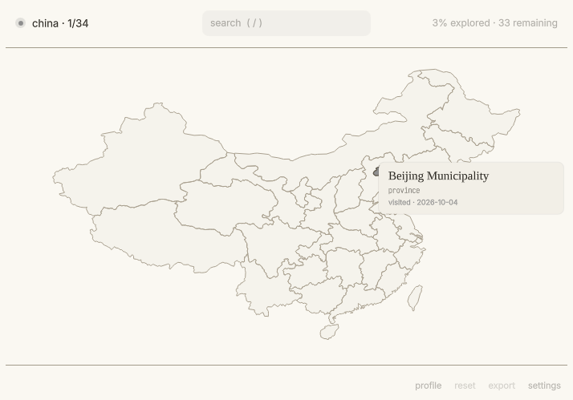</td>
    <td width="50%" align="center"><strong>Germany</strong><br>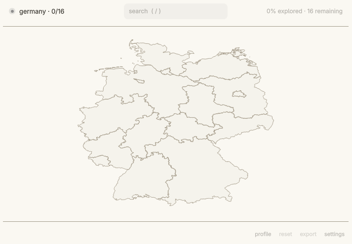</td>
  </tr>
</table>

### In the bar

<table>
  <tr>
    <td width="50%" align="center"><strong>Progress by count</strong><br>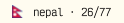</td>
    <td width="50%" align="center"><strong>Progress by percent</strong><br>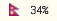</td>
  </tr>
</table>

### Setup, settings, flags

<table>
  <tr>
    <td width="33%" align="center"><strong>Setup, first run</strong><br>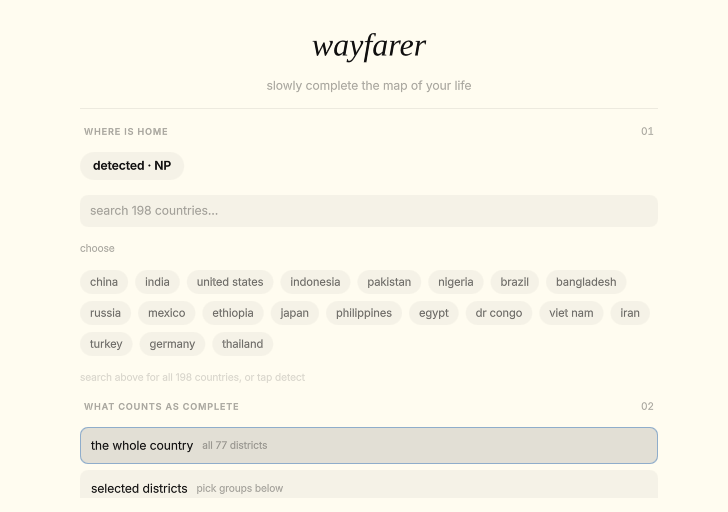</td>
    <td width="33%" align="center"><strong>Settings</strong><br>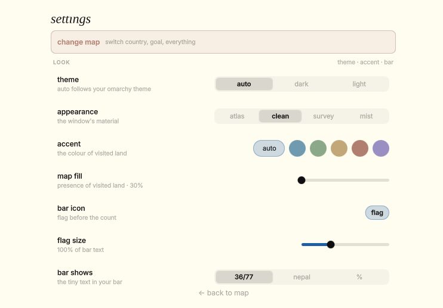</td>
    <td width="33%" align="center"><strong>Flags support</strong><br>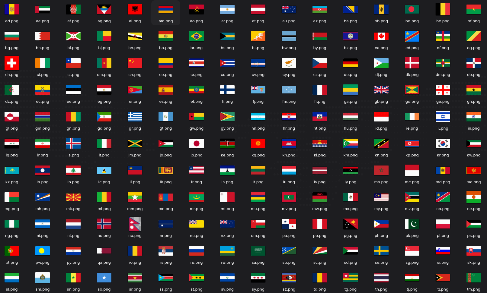</td>
  </tr>
</table>

### Appearances, light and dark

<table>
  <tr>
    <td width="50%" align="center"><strong>Atlas, light</strong><br>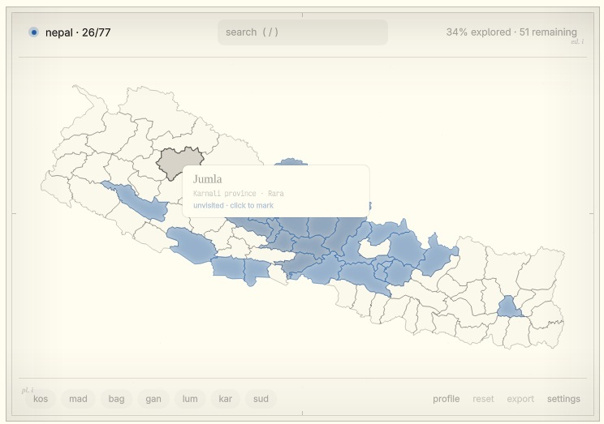</td>
    <td width="50%" align="center"><strong>Atlas, dark</strong><br>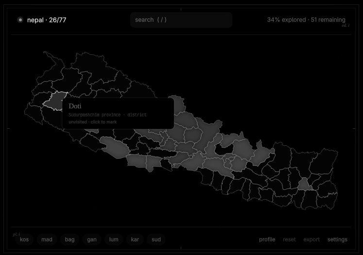</td>
  </tr>
  <tr>
    <td width="50%" align="center"><strong>Clean, light</strong><br></td>
    <td width="50%" align="center"><strong>Clean, dark</strong><br>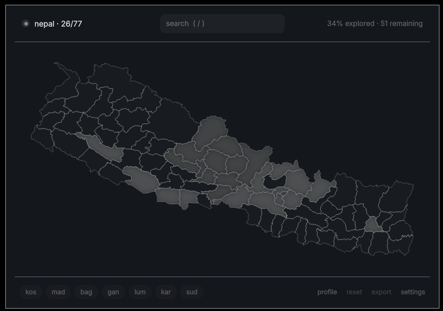</td>
  </tr>
  <tr>
    <td width="50%" align="center"><strong>Survey, light</strong><br>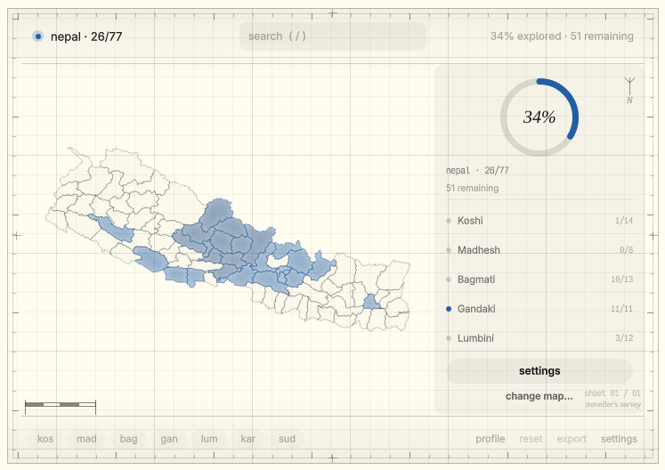</td>
    <td width="50%" align="center"><strong>Survey, dark</strong><br>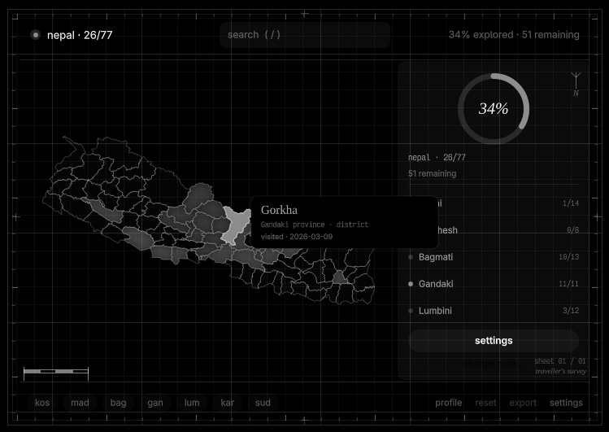</td>
  </tr>
</table>

## Features

| Feature | Description |
| --- | --- |
| **Tiny bar progress** | District count (`36/77`) or percentage, whatever fits the bar. |
| **Large floating map** | Click the bar to open the full map, click a region to mark it visited. |
| **Nepal, all 77 districts** | A shipped district pack with province rings and highlight pins. |
| **198 countries** | First-level boundaries from geoBoundaries, simplified for real-time rendering. |
| **Custom places** | Countries without a pack open in a quiet custom-places mode. |
| **Four appearances** | Atlas, clean, survey, and mist, with light and dark variants each. |
| **Live-reloaded settings** | Accent, bar label, goal, import/export, reset, saved to `~/.local/state/wayfarer/state.json`. |
| **Tile-free rendering** | A Canvas-based renderer with hover/click hit-testing, no map tiles. |

## Layout

| File | Owns |
|---|---|
| `BarWidget.vue` | compact bar text, tooltip, panel lifecycle |
| `MapPanel.vue` | large floating map experience (map / setup / settings modes) |
| `Store.vue` | state, goals, persistence (`~/.local/state/wayfarer/state.json`) |
| `components/MapCanvas.vue` | tile-free Canvas rendering + hover/click hit-testing |
| `components/Tooltip.vue` | minimal dark tooltip |
| `components/DetailCard.vue` | tiny contextual detail view |
| `components/SetupView.vue` | first-run setup: detect + manual fallback, goal picker |
| `components/SettingsView.vue` | accent, bar label, goal, import/export, reset |
| `js/Projection.js` | fit-to-canvas projection, point-in-polygon |
| `js/GeoProvider.js` | country registry + boundary-pack loading |
| `js/LocationDetect.js` | one-shot IP geolocation (setup only, never background) |
| `js/Goals.js` | goal scoping + progress math |
| `data/nepal-districts.json` | 77 districts, simplified geometry (82 KB) |

## Install

```bash
omarchy plugin add https://github.com/paudelsamir/wayfarer.git --enable
```

## Remove

```bash
omarchy plugin remove paudelsamir.wayfarer
```

## Profile

<table>
  <tr>
    <td width="33%" align="center"><strong>Profile, part one</strong><br>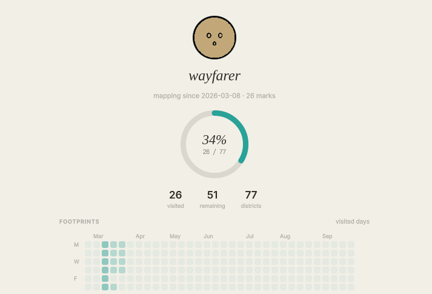</td>
    <td width="33%" align="center"><strong>Profile, part two</strong><br>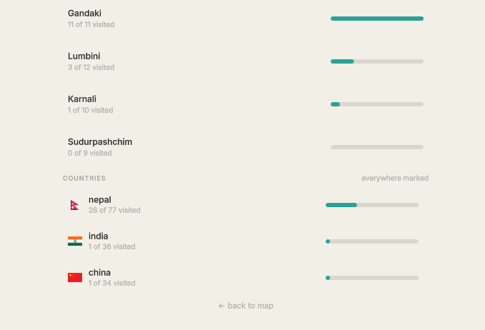</td>
    <td width="33%" align="center"><strong>Share card</strong><br>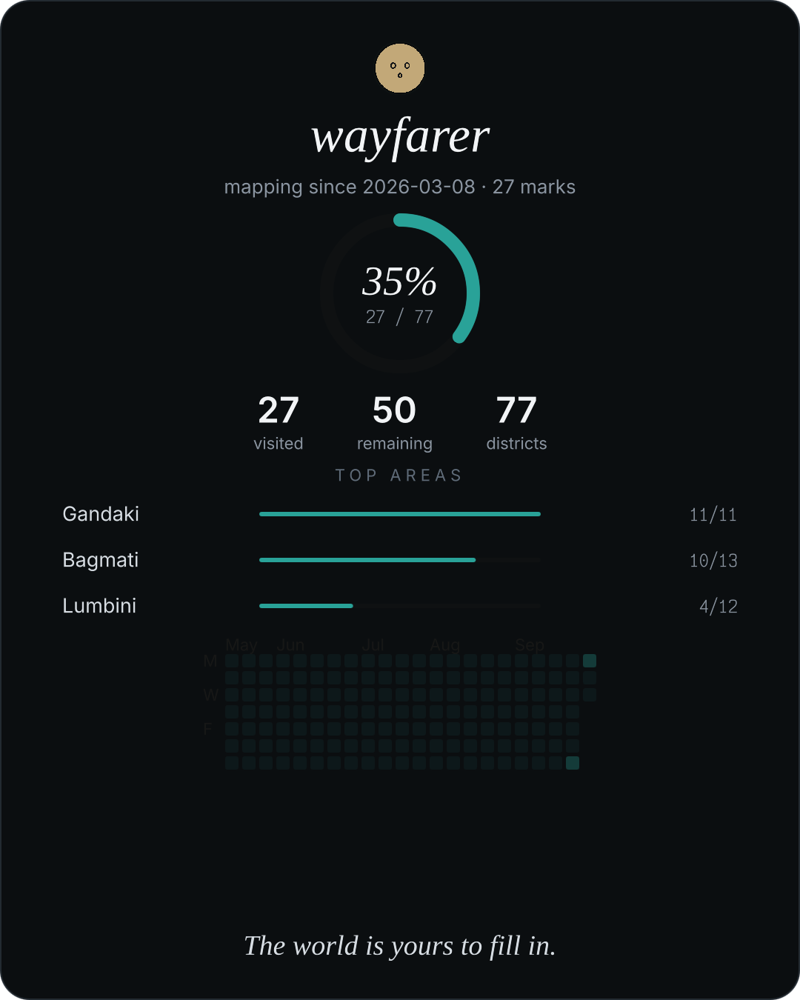</td>
  </tr>
</table>

## Multi-country

198 countries work today. Nepal ships all 77 districts; every other country
ships first-level boundaries (states, provinces, prefectures) from
geoBoundaries, simplified for real-time rendering (see `data/ATTRIBUTION.md`).
`js/GeoProvider.js` is the registry. A new pack is a
`data/packs/<ISO3>.json` file in the normalized shape:

```json
{ "type": "districts", "count": 77,
  "features": [{ "id": "mustang", "name": "Mustang",
                 "province": 4, "provinceName": "Gandaki",
                 "highlights": ["Jomsom", "Marpha"],
                 "rings": [[[lon, lat], ...]] }] }
```

Countries without a pack open in custom-places mode, the UI is identical,
only the canvas shows a quiet note instead of geometry.

## Visual language

Near-black `#0a0c0d`, graphite `#22272c`, hairline `#3a4148` borders, one
accent (default dusty blue `#6f9ab0`), serif place names, no gradients, no
shadows, no cards over the map.